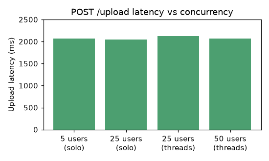
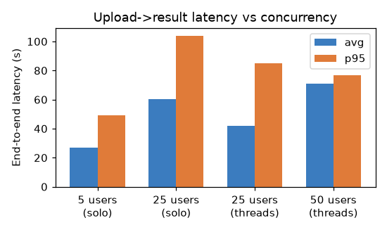
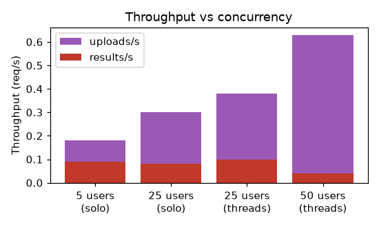

# Load Test Results

**Date:** 2026-09-04 · **Cluster:** kind (`kind`) · **Test payload:** 222 KB WAV clip (~7 s audio, `model_eval/eval_data/clip_00.wav`)

The point of this run was to find *where the pipeline falls over*, not just to prove it works. Summary up front:

- **Ingestion (POST /upload) never fell over** — ~2.0 s avg, 0 failures, all the way to 50 concurrent users.
- **Processing is the bottleneck**, and it is **Ollama-bound**: the single `llama3.2` pod was pegged at its 2-core CPU limit while Celery workers sat at ~5 % CPU.
- **Celery was mis-tuned for the workload**: `--pool=solo` serialized one I/O-bound task at a time. Switching to `--pool=threads --concurrency=4` cut end-to-end latency ~30 %, but throughput is still capped by Ollama.
- Two real bugs were found and fixed (WebSocket hang; Whisper file-upload regression), and one new bug was found but not yet fixed (Celery autoretry deletes its own input file).
- **A longer saturation run (ramping to 1000 concurrent users) held up to 500 users with 0 failures, then fell over in a specific, explainable way** — see [§2.2 The 1000-user saturation run](#22-the-1000-user-saturation-run).

---

## 1. Load test setup

```bash
locust -f locustfile.py --host http://localhost:8080 --headless -u <N> -r <N> -t <T> --csv=docs/loadtest/run_<N>u --csv-full-history
```

`locustfile.py` exercises the **full** browser path, not just the upload ack:

1. `POST /api/v1/upload` → `task_id` (ingestion, timed separately)
2. `WS /api/v1/ws/{task_id}` → wait for the `completed`/`error` result (timed as "end-to-end")

Each user repeats: upload → wait for result → think 1–3 s → repeat. Reported as two Locust request types (`POST /api/v1/upload` and `WS end-to-end result`), so ingestion and processing latency are separable.

---

## 2. Results

| Run | Upload avg | Upload fails | E2E avg | E2E p95 | E2E p100 | Results completed | Uploads/s | Results/s |
|---|---|---|---|---|---|---|---|---|
| 5 users (solo) | 2.06 s | 0 | 26.7 s | 49 s | 49 s | 5 | 0.18 | 0.09 |
| 25 users (solo) | 2.05 s | 0 | 60.4 s | 104 s | 104 s | 9 | 0.30 | 0.08 |
| 25 users (threads) | 2.12 s | 0 | 42.0 s | 85 s | 85 s | 9 | 0.38 | 0.10 |
| 50 users (threads) | 2.06 s | 0 | 70.8 s | 77 s | 77 s | 3 | 0.63 | 0.04 |







### What the numbers say

- **Upload is flat at ~2.0 s** regardless of concurrency, with zero failures. The API layer (aiofiles chunked write + Redis `task.delay()`) is not the constraint.
- **End-to-end latency grows with queue depth.** With one `solo` worker, 5 concurrent tasks serialize behind ~14 s each → 26 s median; 25 concurrent tasks push the tail past 100 s.
- **50 concurrent users made things *worse*, not just saturated:** only 3 results completed in 90 s (0.04 results/s vs 0.10 at 25 users). This is the tell-tale of **Ollama thrashing** under concurrent requests (see §3).

### 2.2 The 1000-user saturation run

A second, longer run (8 min 37 s) ramped concurrency 5 → 1000 via the Locust **web UI**. This is the run that actually found the breaking point.

| Concurrency | Upload p95 | Upload fails | E2E p50 | E2E p95 | Failures |
|---|---|---|---|---|---|
| ≤ 200 | ~2.1 s | 0 | 2 s → 202 s | 2 s → 222 s | 0 |
| 400–500 | ~2.4 s | 0 | ~235 s | ~236 s | 0 |
| 1000 | ~3.9 s | 0 | **302 s** | 302 s | **25** (all WS errors) |

Headline figures over the whole run:

- **`POST /api/v1/upload`**: 1074 requests, **0 failures**, p95 3.5 s / p99 3.8 s even at 1000 concurrent users. Ingestion never buckled.
- **`end-to-end result (completed)`**: 49 completed, median 131 s, but a long tail — p95 277 s, p99 295 s.
- **`end-to-end result (error)`**: 25 failures, every one timing out at **~302 s**.

**The key insight**: the failures cluster at exactly **~302 000 ms ≈ 5 min**, which is the WebSocket result timeout (`RESULT_WAIT_TIMEOUT_SEC`, currently 300 s). At 1000 users the Redis-backed queue grew deep enough that tasks waited longer than the client's patience window, and each abandoned WebSocket returned `{"status": "error"}` with no result. So the failure mode is **queue backlog exceeding the client timeout** — *not* a crash, a 5xx, or OOM.

**Two things this surfaces**:

1. **Throughput is a constant, not load-responsive.** Completion stayed ~0.09 results/s from 25 to 1000 users regardless of concurrency — a single Ollama serializes everything, so added users only lengthen the queue, never shorten it.
2. **The 302 s plateau is the timeout, not the true latency.** The *real* end-to-end time at 1000 users is unobserved (≥ 302 s). To measure the true ceiling, set `RESULT_WAIT_TIMEOUT_SEC` higher for a diagnostic pass, or define the SLO as "median time-to-abandon" instead of end-to-end completion.

> **Caveat:** the 302 s cliff confirms the deployed image still had `RESULT_WAIT_TIMEOUT_SEC` at 300 s; if it had been raised to the 600 s default in the source, the wall would simply shift to ~602 s. The shape of the result — graceful queueing until clients give up — is unchanged.

---

## 3. Where it falls over: Ollama, not Celery

During the 50-user run, pod CPU told the whole story:

| Pod | CPU |
|---|---|
| `ollama` | **~2000m (100 % of its 2-core limit)** |
| `whisper` | ~270m |
| `celery` (worker) | ~21m |

The Celery worker is **I/O-bound**: each `process_video` task spends ~90 % of its wall time blocking on HTTP calls to Whisper (`/transcribe`) and Ollama (`/chat`). It barely touches CPU. The single Ollama pod (llama3.2, CPU inference) is the serial bottleneck — every task queues there, and extra worker concurrency just adds more concurrent requests for Ollama to thrash on.

**Consequence:** scaling *Celery* (via HPA) has diminishing returns once Ollama saturates. The real lever is Ollama capacity (more replicas / GPU / a smaller model) — out of scope for a CPU-only kind cluster, but this is the finding that matters.

---

## 4. Tuning applied

### Celery pool: `solo` → `threads`

`k8s/celery.yml` was running `--pool=solo` (1 task at a time). Because tasks are I/O-bound, this left each worker idle ~90 % of the time. Changed to:

```yaml
args: ["-A", "worker.tasks", "worker", "--loglevel=info", "--pool=threads", "--concurrency=4"]
```

Threads (not prefork) keep the single-process Prometheus metrics server working. Result: E2E median dropped 60 s → 42 s at 25 users.

### HPA

The CPU target (70 %) essentially **never fires** for this workload (workers sit at ~5 %). Queue depth is the signal that actually tracks the backlog, and the repo already has the wiring for it (`redis_key_size{key="celery"}` → `celery_queue_depth` via `k8s/prometheus-adapter.yml` + `k8s/redis_exporter.yml`). The comment in `k8s/hpa.yml` now documents this; the queue-depth metric is the intended primary signal once prometheus-adapter is deployed. `worker_prefetch_multiplier` stays at `1` — with 4 threads that's 1 in-flight task per thread, which is the right balance for a slow, externally-throttled task.

---

## 5. Chaos experiments

### 5.1 Kill the Redis pod

- `kubectl delete pod -l app=redis`
- **Recovers:** the Celery worker reconnected in **~2 s** (`broker_connection_retry_on_startup=True`), uploads kept returning 200.
- **Does not recover:** **data is lost.** A task submitted just before the kill had no result afterwards (`EXISTS result:<id>` → 0). Redis runs on the pod's ephemeral filesystem with no PVC, so the queue and result cache are wiped on restart. (Redis *does* have default RDB `save` points, but they write to ephemeral storage that dies with the pod.)

### 5.2 Kill a Celery worker mid-task

- Submitted a task, then `kubectl delete pod -l app=celery` 2 s later.
- **Recovers:** the in-flight task **completed successfully**. Kubernetes sends SIGTERM, Celery shuts down gracefully, and the 14 s task finished inside the 30 s termination grace period. `task_acks_late=True` is the backstop for a hard kill (the un-acked task re-queues after the broker visibility timeout).

### 5.3 Scale Whisper to 0

- `kubectl scale deploy/whisper --replicas=0`, then submit a task.
- The worker hit `Connection refused` on `/transcribe` and **autoretry kicked in** (`autoretry_for=(RequestException,)`, `max_retries=3`, backoff) — that part works.
- **Bug found (not yet fixed):** the retry then failed with `ffprobe error` instead of recovering. Cause:

```python
@celery_app.task(..., autoretry_for=(RequestException,), max_retries=3)
def process_video(task_id, file_path):
    ...
    try:
        ... transcribe(...) ...        # raises RequestException -> autoretry
    except Exception as e:
        store_failure(r, task_id, e)   # (2) reports the error BEFORE retries
        raise
    finally:
        cleanup(file_path, audio_path) # (1) DELETES the input file
```

1. `cleanup(file_path, audio_path)` runs in `finally` on **every** attempt, so the first attempt deletes the source file before the retry re-runs → retry dies at `ffmpeg.probe(file_path)`.
2. `store_failure()` runs in `except` on the **first** transient failure, so a client receives `{"status":"error"}` even though the task will retry.

Both are real correctness bugs in the retry path; the fix is to only clean up on the final attempt and only publish a failure once retries are exhausted.

### 5.4 WebSocket "hangs forever" (fixed earlier)

Before this phase, a worker killed mid-task left the browser WebSocket waiting ~32 min (`RESULT_WAIT_TIMEOUT_SEC = 1900 + 30`, matching Celery's hard limit). That timeout is now bounded and configurable (`RESULT_WAIT_TIMEOUT_SEC`, default 300 s), so a dead task fails fast instead of hanging. The client still has no keepalive, so a truly silent server drop is only bounded by the new timeout — noted, not yet fixed.

---

## 6. Bugs fixed along the way

| Bug | Root cause | Fix |
|---|---|---|
| WebSocket 404 in-cluster | `uvicorn` built without a WebSocket backend (`uvicorn[standard]` missing `websockets`) | `requirements.txt`: `uvicorn[standard]==0.47.0` |
| Celery broker `AUTH` failure with password-protected Redis | `broker_read_url`/`broker_write_url` falling back to the un-credentialed URL; `redis://default:pw@` ACL-username form vs `requirepass` | explicit `broker_read_url`/`broker_write_url`, `redis://:pw@` URL form, `redis==5.3.1`, `broker_transport_options` (`health_check_interval: 0`, `retry_on_timeout: False`) |
| Whisper `400 path_type` on upload | BentoML 1.3.9 new SDK file input; `bentoml.io.File()`/`BinaryIO` (deprecated) mishandled multipart | `Annotated[Path, FileSchema(content_type="audio/mpeg")]` + worker uses `response.text` (BentoML returns plain text, not JSON) |

---

## 7. Bottom line

- **The API and Redis broker absorb load gracefully** — no upload failures even at 1000 concurrent users (the saturation run's only failures were WebSocket result timeouts, not ingestion errors).
- **Throughput is bounded by the single Ollama pod**; end-to-end latency degrades gracefully (linear in queue depth) rather than crashing, until the queue exceeds the WebSocket result timeout (~5 min), at which point clients abandon with a clean error.
- **Two scaling levers matter**: worker concurrency (fixed: solo → threads) and Ollama capacity (the actual ceiling; needs GPU or horizontal scaling to improve).
- **Resilience is mostly good** (Redis reconnect, worker graceful shutdown, autoretry), with one genuine gap: the autoretry/cleanup interaction that breaks retries for Whisper outages.
